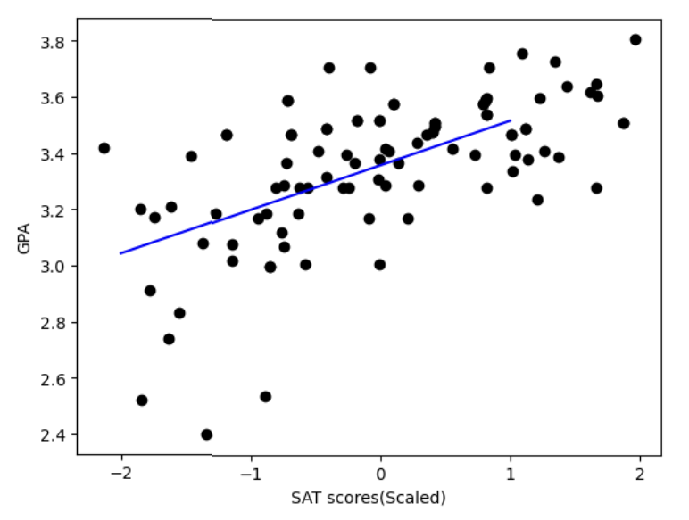

# 📊 Linear Regression from Scratch in Python

This project demonstrates how to implement **simple linear regression** using only NumPy and Pandas — without relying on libraries like `scikit-learn`.

## 🚀 Project Overview

- **Objective**: Predict a student's GPA based on their SAT score
- **Dataset**: [Simple Linear Regression Dataset from Kaggle](https://www.kaggle.com/datasets/japondo/simple-linear-regression?utm_source=chatgpt.com) 
- **Approach**: Implemented gradient descent manually to minimize Mean Squared Error (MSE)

---

## 🧠 Key Concepts Covered

- Linear regression fundamentals
- Mean squared error (MSE) loss
- Gradient descent optimization
- Feature scaling (standardization)
- Effect of learning rate on convergence

---

## 📈 Results

After applying feature scaling to the SAT scores and using a learning rate of **0.01**, the model converged effectively, producing the following regression line:

> Without scaling, large SAT values caused gradient overflow and unstable updates. After standardizing the SAT values, the model trained smoothly and showed a clear positive trend between SAT and GPA.

---
